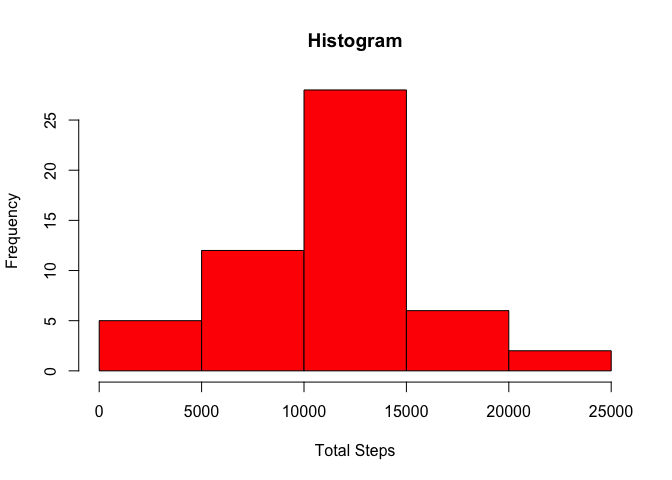
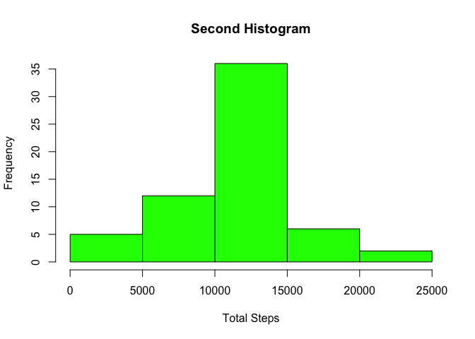
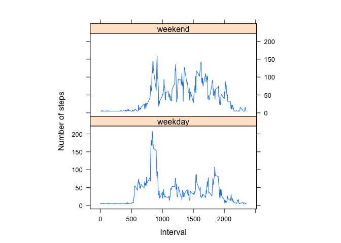

# Reproducible Research: Peer Assessment 1


## Loading and preprocessing the data

```r
library(dplyr)
```

```
## 
## Attaching package: 'dplyr'
## 
## The following object is masked from 'package:stats':
## 
##     filter
## 
## The following objects are masked from 'package:base':
## 
##     intersect, setdiff, setequal, union
```

```r
##Assumption - activity.csv file is present in the working directory

myfile <-read.csv("activity.csv",header=T)

## keeping only data with no missing values by using complete.cases
good <-complete.cases(myfile)
myfile <- myfile[good,]
```

```r
## What is mean total number of steps taken per day?
```

```r
## grouping the data by date
myfile_dates <- group_by(myfile,date)
## adding a column that gives the total steps per dayh
myfile_dates <- summarise(myfile_dates,total_steps = sum(steps))

## making a histogram of the total steps
hist(myfile_dates$total_steps,col="red",xlab="Total Steps", main = "Histogram")
```

 

```r
## mean and median of total steps and printing
mean_steps <- mean(myfile_dates$total_steps)
cat("Mean is",(mean_steps))
```

```
## Mean is 10766.19
```

```r
median_steps <- median(myfile_dates$total_steps)
cat("Median is",(median_steps))
```

```
## Median is 10765
```

```r
## What is the average daily activity pattern?
```

```r
## time series plot
## aggregating the data for steps vs interval
steps_int <- aggregate(steps ~ interval, data = myfile , mean)

## drawing the plot
plot(steps ~ interval, data = steps_int, type = "l")
```

 

```r
## finding the max interval
steps_int[which.max(steps_int$steps),]$interval
```

```
## [1] 835
```

```r
## Imputing missing values
```

```r
## Reading the activity file in activity_data data frame and calculating number of rows
activity_file <- read.csv("activity.csv",header=T)
numrows <-nrow(activity_file) 

##Calculating missing rows

missing_rows <- nrow(activity_file[is.na(activity_file$steps),])
cat("Number of missing rows is",(missing_rows))
```

```
## Number of missing rows is 2304
```

```r
## My strategy is to replace all NAs with the mean value of the steps from myfile data frame
## replacing missing value with the mean of the steps
## New data set is activity_data
activity <- activity_file
numrow <- is.na(activity_file$steps)
activity$steps[numrow] <- mean(activity_file$steps,na.rm=T)
new_totalSteps <- aggregate(steps ~ date, data = activity, sum)
## creating a histogram of new data set total steps
hist(new_totalSteps$steps,col="green",xlab="Total Steps", main = "Second Histogram")
```

 

```r
## Calculating and printing new mean
new_mean <-mean(new_totalSteps$steps)
cat("New mean is",(new_mean))
```

```
## New mean is 10766.19
```

```r
## Calculating and printing new median
new_median <- median(new_totalSteps$steps)
cat("New median is",(new_median))
```

```
## New median is 10766.19
```

```r
##Do these values differ from the estimates from the first part of the assignment
##< Mean is the same, median is slightly different>

##What is the impact of imputing missing data on the estimates of the total daily number of steps?
## < There is no impact as seen from the 2 histogram plots>
```

```r
## Are there differences in activity patterns between weekdays and weekends?
```

```r
## Creating a factor variable in the activity dataset to identify if its a weekday or weekend. Weekend = "Saturday/Sunday"

activity$days <- factor(weekdays(as.Date(activity$date)) %in% c("Saturday","Sunday"))

## Adding the 2 levels 
levels(activity$days)[levels(activity$days)=="TRUE"] <- "weekend"
levels(activity$days)[levels(activity$days)=="FALSE"] <-"weekday"

## aggregating data over the weekday/weekend
mod_Steps_int <- aggregate(steps~interval + days,data = activity, mean)

## using lattice to create the plot
library(lattice)
xyplot(steps ~ interval | factor(days), data = mod_Steps_int, aspect = 1/2, type = "l", xlab = "Interval",ylab = "Number of steps")
```

 

